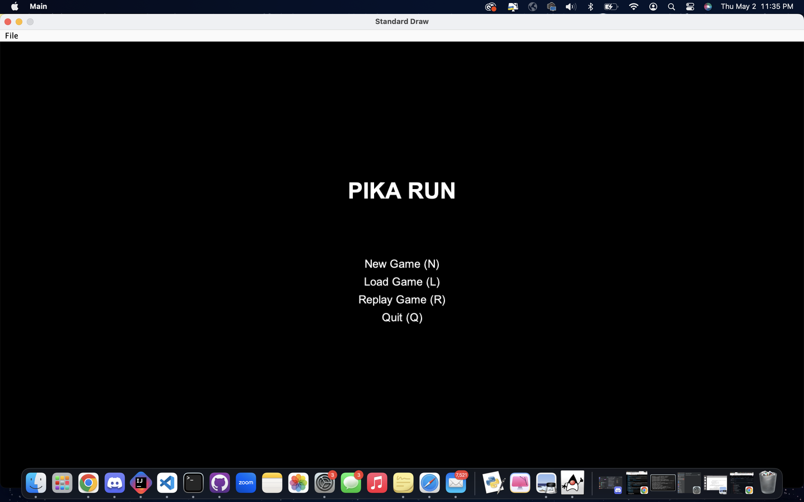
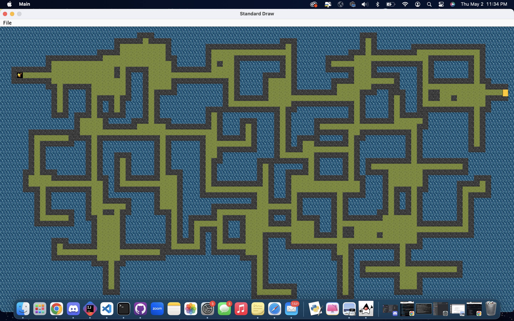

# Pika-Run

## Open World Mini Game-

## Classes and Data Structures
Engine class: is the central component of a text-based game application that simulates a world exploration experience.
It manages the game mechanics, user interactions, and graphical rendering of the game world. The class contains methods
for generating the game world, handling player movements, displaying menus and screens, managing game state, saving and
loading progress, and interacting with user inputs. The game is played on a grid of tiles, with players navigating 
through rooms and corridors, seeking an exit, and encountering obstacles.

Room Class: The class contains methods for creating, connecting, and managing rooms and hallways within a grid-based
environment represented by a two-dimensional array of tiles (TETile).
The Room class is intended to handle the procedural generation of rooms and hallways within a grid-based world.
It is part of a larger system that generates and manages the layout of rooms, corridors,
and connections to create a dynamic game environment.

## Algorithms

1. Room Generation:
The createWorld() method uses a room generation algorithm to create rooms and corridors within the game world.
The algorithm generates a random layout of interconnected rooms and corridors, ensuring a coherent 
and navigable environment.
It populates the TETile grid with floor tiles and walls to represent the rooms and corridors.

2. Farthest Points:
The findFarthestPoints() method employs an algorithm to determine the farthest points on the game grid.
It calculates the Euclidean distance between all pairs of points in the game world and identifies
the pair with the maximum distance.
This algorithm helps place the player's starting position and the exit gate in distant locations, promoting exploration.

3. Adjust Gate Location:
The adjustGateLocation() method adjusts the location of the exit gate to ensure it is adjacent to a floor tile.
The algorithm checks neighboring tiles around the chosen gate location and shifts
it if needed to make it accessible to the player.

4. Player Movement:
The movements() method handles player movement based on user input ('w', 's', 'a', 'd').
It calculates the next position based on the current position and the desired movement direction.
The algorithm verifies if the next position is a valid move (e.g., onto a floor tile) and updates 
the playable character's position accordingly.

5. Input Processing:
The processInput() method recursively processes a string of user input characters.
It processes each character one by one, simulating the effect of the user's keyboard inputs.
The algorithm triggers appropriate actions based on the input character, such as navigating 
menus or moving the player character

6. Replay Game:
The replayGame() method simulates the replay of a saved game by processing each character in the saved input string.
The algorithm iterates through the input string, triggering actions as if the user is interacting with the game 
in real-time.
It renders each frame of the game world and introduces delays to create a visual representation of the game's history.

7. World Rendering:
The interactWithKeyboard() method contains the main game loop responsible for rendering the game world.
The algorithm continuously renders the game world using the TETile library and updates the display based on
user inputs and game state changes.

8. Save and Load:
The saveGame() method saves the game state to a file using file I/O operations.
The loadGame() method loads a previously saved game state from a file.
These algorithms involve reading and writing data to/from files to preserve game progress

9. HUD Screen Update:
The hudScreen() method updates the Heads-Up Display (HUD) screen with information such as player position,
time, and relevant game data.
The algorithm refreshes the HUD display at regular intervals to provide real-time information to the player
